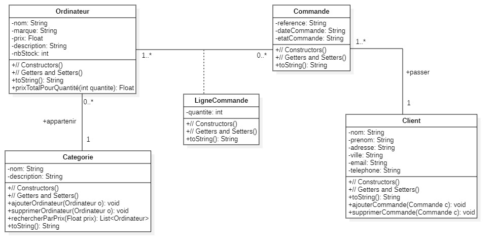

# Object-Oriented Programming in Java - Practical Exercises

This folder contains a set of practical exercises aimed at exploring and implementing key object-oriented programming (OOP) concepts using Java. Each exercise demonstrates different principles of OOP, including inheritance, polymorphism, abstract classes, interfaces, and class associations. These exercises are designed to deepen understanding and application of OOP in a structured, modular, and scalable manner.

## Objectives

The primary objectives of this README are to:

* Develop and explain the code for each exercise with clear, practical examples.
* Highlight OOP principles such as inheritance, encapsulation, polymorphism, modularity, and code reusability.
* Justify technical choices by detailing how each part of the code meets the exercise requirements.
* Identify key learning outcomes and address challenges encountered in implementing OOP principles.

## Exercise 1: Library Management with Inheritance and Method Overriding

**Overview**
This exercise focuses on building a library management application that applies concepts like inheritance, method overriding, and encapsulation. It includes classes for managing information on library members, authors, and books, illustrating the relationships and modular structure within an OOP framework.

**Code Structure and Explanation**
* **Class Person:** Serves as the base class for all individuals associated with the library, implementing encapsulation by keeping attributes private and exposing them via getters and setters.
* **Class Adherent and Class Author:** These classes inherit from Person and add specific attributes (e.g., unique membership and author IDs). Methods are overridden to provide additional functionality.
* **Class Book:** Associates each book with an author, illustrating the concept of composition.
* **Class Main:** Tests the functionality of the application by creating instances and demonstrating inheritance and method overriding.

## Exercise 2: Employee Salary Management with Abstract Classes and Polymorphism

**Overview**
This exercise models an employee management application that categorizes employees (e.g., engineers and managers) and calculates their salaries according to their role. This exercise uses abstract classes, inheritance, and polymorphism to handle salary computations based on employee type.

**Code Structure and Explanation**
* **Abstract Class Employee:** Defines the common attributes for all employees and declares an abstract method `calculateSalary()` for specific salary calculations.
* **Classes Engineer and Manager:** Inherit from Employee, each implementing `calculateSalary()` with a custom formula specific to their role, showcasing polymorphism.
* **Class Main:** Tests inheritance and method overriding by creating instances of Engineer and Manager and calculating their salaries.

## Exercise 3: Order Management System for Computers with Class Associations and Composition

**Overview**
This exercise designs an order management system for a company selling computers. It employs principles of class association, composition, and encapsulation to represent the relationships between clients, orders, computers, and order lines.

**Code Structure and Explanation**
* **Class Category:** Groups computers into categories based on shared characteristics, illustrating a composition of multiple computers within a category.
* **Class Client:** Associates each client with their orders, demonstrating a one-to-many relationship between client and order.
* **Class Order:** Represents individual orders, containing references to the client and the order's date and status.
* **Class OrderLine:** Connects an Order with a specific Computer, representing the quantity of the item ordered.
* **Class Computer:** Represents a product with detailed attributes, making it manageable within stock and categories.
* **Class Main:** Demonstrates interactions between the different entities by creating instances and linking them, showing the relationships in action.

## Exercise 4: Product Management System with Interface and Implementation

**Overview**
In this exercise, we create a product management system that employs an interface to define basic operations for managing products, separating the definition of operations from their implementation to ensure flexibility.

**Code Structure and Explanation**
* **Interface IProductService:** Defines CRUD (Create, Read, Update, Delete) operations that any implementation must provide, allowing for flexible and extensible code.
* **Class ProductServiceImpl:** Implements `IProductService` to manage products via a dynamic list. It includes methods to add, retrieve, search, and delete products.
* **Class Product:** Represents individual products with attributes like name, brand, price, and stock.
* **Class Application:** Provides a command-line interface for users to interact with the product management system, implementing a user-friendly menu to execute CRUD operations.

## General Conclusion

This project demonstrates the application of core object-oriented programming concepts in Java. Each exercise provides insight into specific OOP principles and their utility in structuring modular, flexible, and maintainable code.

Key takeaways include:

* Inheritance and Method Overriding: Exercises 1 and 2 showcase the advantages of structuring code hierarchically, reusing common attributes, and defining specialized behavior in derived classes.
* Abstract Classes and Polymorphism: Using abstract classes and polymorphic behavior in Exercise 2 allows for flexible implementation of functionality across different types of employees.
* Class Associations and Composition: Exercises 3 and 4 illustrate the importance of organizing relationships between objects, making data management more intuitive and clear.
* Interfaces for Flexibility: In Exercise 4, interfaces help define consistent operations, allowing for independent implementations that can evolve based on future requirements.

By applying these principles, this project demonstrates how OOP can create robust, organized, and scalable applications where encapsulation, inheritance, polymorphism, and modularity promote secure data management and code extensibility.