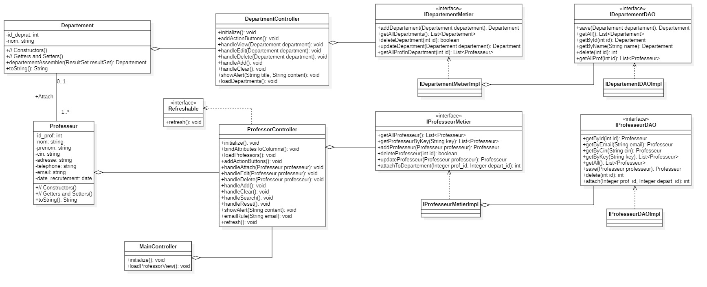
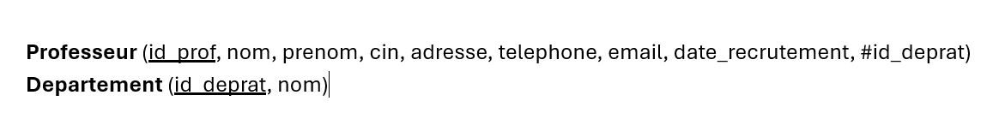

# JavaFX and Database Access Lab

This folder contains a Java project for managing a school application. The project demonstrates various aspects of Java programming, including controllers, data access objects (DAOs), business logic, and views.

## Class Diagram and Database Schema
- **Class Diagram**: 


- **Database Schema (MLD)**:



## Packages

### [Console](src/main/java/ma/enset/tp5/Console/README.md)
- **Main class**: `Main`
- **Description**: This package contains the main entry point for the console-based application.

### [Controller](src/main/java/ma/enset/tp5/controller/README.md)
- **Classes**: `DepartmentController`, `MainController`, `ProfessorController`, `Refreshable`
- **Description**: This package contains the controllers responsible for handling user interactions and updating the views accordingly.

### [DAO](src/main/java/ma/enset/tp5/dao/README.md)
- **Interfaces**: `IDepartementDAO`, `IProfesseurDAO`
- **Singleton**: `SignletonConnexionDB`
- **Implementations**: `IDepartementDAOImpl`, `IProfesseurDAOImpl`
- **Description**: This package contains the data access objects (DAOs) for interacting with the database.

### [Metier](src/main/java/ma/enset/tp5/metier/README.md)
- **Interfaces**: `IDepartementMetier`, `IProfesseurMetier`
- **Implementations**: `IDepartementMetierImpl`, `IProfesseurMetierImpl`
- **Description**: This package contains the business logic for managing departments and professors.

### [Model](src/main/java/ma/enset/tp5/model/README.md)
- **Classes**: `Departement`, `Professeur`
- **Description**: This package contains the model classes representing the entities in the application.

### [Resources](src/main/resources/ma/enset/tp5/view/README.md)
- **Views**: `department-view.fxml`, `main-view.fxml`, `professor-view.fxml`
- **Description**: This package contains the FXML files for the application's user interface.

### [Main Java Directory](src/main/java/README.md)
- **Classes**: `SchoolApplication`, `module-info.java`
- **Description**: This directory contains the main application class `SchoolApplication` which is the entry point for the JavaFX application, and the `module-info.java` file which defines the module configuration for the project.


## Project Structure
```
├───java
│   │   module-info.java
│   │   README.md
│   │
│   └───ma
│       └───enset
│           └───tp5
│               │   SchoolApplication.java
│               │
│               ├───Console
│               │       Main.java
│               │       README.md
│               │
│               ├───controller
│               │       DepartmentController.java
│               │       MainController.java
│               │       ProfessorController.java
│               │       README.md
│               │       Refreshable.java
│               │
│               ├───dao
│               │   │   IDepartementDAO.java
│               │   │   IProfesseurDAO.java
│               │   │   README.md
│               │   │   SignletonConnexionDB.java
│               │   │
│               │   └───impl
│               │           IDepartementDAOImpl.java
│               │           IProfesseurDAOImpl.java
│               │
│               ├───metier
│               │   │   IDepartementMetier.java
│               │   │   IProfesseurMetier.java
│               │   │   README.md
│               │   │
│               │   └───impl
│               │           IDepartementMetierImpl.java
│               │           IProfesseurMetierImpl.java
│               │
│               └───model
│                       Departement.java
│                       Professeur.java
│                       README.md
│
└───resources
    └───ma
        └───enset
            └───tp5
                └───view
                        department-view.fxml
                        main-view.fxml
                        professor-view.fxml
                        README.md
```