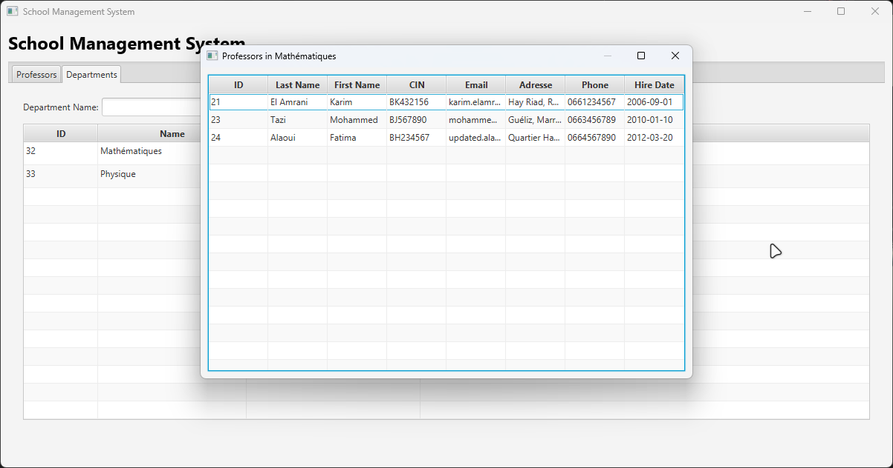

# Controller Package

## Description
This package contains the JavaFX controllers that manage the user interface and business logic for the Professor and Department management system. The controllers handle user interactions, data manipulation, and view updates.

## Controllers

### MainController
- Manages the main application window and navigation
- Handles tab switching between different views
- Coordinates the refresh mechanism for views

#### MainController Methods

##### Fields
```java
@FXML
private TabPane tabPane;
@FXML
private Tab professorTab;
private ProfessorController professorController;
```
These fields represent:
- `tabPane`: The main container that holds all tabs in the application
- `professorTab`: The specific tab for professor management
- `professorController`: Reference to the professor controller for handling professor-related operations

##### Initialize Method
```java
@FXML
public void initialize() {
    loadProfessorView();
    tabPane.getSelectionModel()
            .selectedItemProperty()
            .addListener((observable, oldTab, newTab) -> {
                if (newTab == professorTab && professorController != null) {
                    professorController.refresh();
                }
            });
}
```
This method is automatically called after FXML loading and:
- Initializes the professor view by loading its FXML
- Sets up a listener on tab selection changes
- When the professor tab is selected, it automatically refreshes the professor view to ensure data is up-to-date

##### Load Professor View Method
```java
private void loadProfessorView() {
    try {
        FXMLLoader loader = new FXMLLoader(
                Objects.requireNonNull(
                        getClass().getResource("/ma/enset/tp5/view/professor-view.fxml")
                )
        );
        professorTab.setContent(loader.load());
        professorController = loader.getController();
    } catch (IOException e) {
        e.printStackTrace();
    }
}
```
This method handles the loading of the professor view and:
- Creates a new FXMLLoader for the professor view FXML file
- Loads the FXML content and sets it as the content of the professor tab
- Gets and stores the reference to the professor controller for later use
- Includes error handling for potential IO exceptions during FXML loading

## ProfessorController
- Manages professor-related operations:
  - Add/Edit/Delete professors
  - Search professors by keyword
  - Attach professors to departments
  - View and update professor details
  - Form validation (email, required fields)
  - Data refresh functionality

### ProfessorController Methods

#### Fields
```java
@FXML
private TableView<Professeur> professorTable;
@FXML
private TableColumn<Professeur, Integer> idColumn;
@FXML
private TableColumn<Professeur, String> firstNameColumn, lastNameColumn, cinColumn, 
    emailColumn, phoneColumn, addressColumn;
@FXML
private TableColumn<Professeur, LocalDate> hireDateColumn;
@FXML
private TableColumn<Professeur, Departement> departmentColumn;
@FXML
private TableColumn<Professeur, Void> actionsColumn;
@FXML
private TextField firstNameField, lastNameField, cinField, emailField, 
    phoneField, addressField, searchField;
@FXML
private DatePicker hireDatePicker;
@FXML
private Button addButton;

private final IProfesseurMetier professeurMetier = new IProfesseurMetierImpl(new IProfesseurDAOImpl());
private final ObservableList<Professeur> observableProfessors = FXCollections.observableArrayList();
private Professeur selectedProfesseur;
```
These fields represent:
- Table components for displaying professors
- Form fields for professor data input
- Search functionality components
- Business logic interface for professor operations
- Observable list for dynamic UI updates
- Reference to currently selected professor

#### Initialize Method
```java
@FXML
public void initialize() {
    bindAttributesToColumns();
    loadProfessors();
    addActionButtons();
    professorTable.setItems(observableProfessors);
}
```
This method:
- Binds table columns to professor properties
- Loads initial professor data
- Adds action buttons to each table row
- Binds the table to the observable professor list

#### Bind Attributes to Columns Method
```java
public void bindAttributesToColumns() {
  idColumn.setCellValueFactory(new PropertyValueFactory<>("id_prof"));
  firstNameColumn.setCellValueFactory(new PropertyValueFactory<>("prenom"));
  lastNameColumn.setCellValueFactory(new PropertyValueFactory<>("nom"));
  cinColumn.setCellValueFactory(new PropertyValueFactory<>("cin"));
  emailColumn.setCellValueFactory(new PropertyValueFactory<>("email"));
  phoneColumn.setCellValueFactory(new PropertyValueFactory<>("telephone"));
  hireDateColumn.setCellValueFactory(new PropertyValueFactory<>("date_recrutement"));
  addressColumn.setCellValueFactory(new PropertyValueFactory<>("addresse"));
  hireDateColumn.setCellValueFactory(new PropertyValueFactory<>("date_recrutement"));
  departmentColumn.setCellValueFactory(new PropertyValueFactory<>("departement"));
  departmentColumn.setCellFactory(column -> new TableCell<>() {
    @Override
    protected void updateItem(Departement departement, boolean empty) {
      super.updateItem(departement, empty);
      Professeur professeur = getTableRow().getItem();
      if (empty || professeur == null) {
        setText(null);
      } else if (departement == null) {
        setText("Not defined");
      } else {
        setText(departement.getNom());
      }
    }
  });
}
```
This method:
- Maps table columns to professor object properties
- Sets up custom rendering for the department column
- Configures how data is displayed in each column

#### Load Professors Method
```java
public void loadProfessors() {
    observableProfessors.clear();
    List<Professeur> professeurs = professeurMetier.getAllProfesseur();
    observableProfessors.addAll(professeurs);
}
```
This method:
- Clears existing professors from the observable list
- Fetches all professors from the database
- Updates the UI with fresh professor data

#### Handle Add Method
```java
@FXML
public void handleAdd() {
    // Collect form data
    String firstName = firstNameField.getText().trim();
    String lastName = lastNameField.getText().trim();
    String cin = cinField.getText().trim();
    String email = emailField.getText().trim();
    String phone = phoneField.getText().trim();
    String address = addressField.getText().trim();
    LocalDate hireDate = hireDatePicker.getValue();

    // Validate form data
    if (firstName.isEmpty() || lastName.isEmpty() || phone.isEmpty() || 
        cin.isEmpty() || email.isEmpty() || address.isEmpty() || hireDate == null) {
        showAlert("All Fields are required! They Cannot be empty!");
        return;
    }
    if (!emailRule(email)) {
        showAlert("The email should be in this form: exemple-exemple@gmail.com");
        return;
    }

    // Update or create professor
    if (selectedProfesseur != null) {
        updateExistingProfessor(firstName, lastName, cin, email, phone, address, hireDate);
    } else {
        createNewProfessor(firstName, lastName, cin, email, phone, address, hireDate);
    }

    loadProfessors();
    handleClear();
}
```
This method:
- Collects and validates all form inputs
- Checks for required fields and email format
- Updates existing professor or creates a new one
- Refreshes the professor list and clears the form

#### Handle Edit Method
```java
public void handleEdit(Professeur professeur) {
    selectedProfesseur = professeur;
    firstNameField.setText(professeur.getPrenom());
    lastNameField.setText(professeur.getNom());
    cinField.setText(professeur.getCin());
    emailField.setText(professeur.getEmail());
    phoneField.setText(professeur.getTelephone());
    addressField.setText(professeur.getAddresse());
    hireDatePicker.setValue(professeur.getDate_recrutement());
    addButton.setText("Update");
}
```
This method:
- Sets the selected professor for editing
- Populates form fields with professor data
- Changes the add button text to indicate update mode

### Screenshot


#### Handle Delete Method
```java
public void handleDelete(Professeur professeur) {
    Alert alert = new Alert(Alert.AlertType.CONFIRMATION);
    alert.setTitle("Delete Professor");
    alert.setHeaderText("Delete Confirmation");
    alert.setContentText("Are you sure you want to delete professor: " + 
        professeur.getPrenom() + " " + professeur.getNom() + "?");

    Optional<ButtonType> result = alert.showAndWait();
    if (result.isPresent() && result.get() == ButtonType.OK) {
        professeurMetier.deleteProfesseur(professeur.getId_prof());
        loadProfessors();
    }
}
```
This method:
- Shows a confirmation dialog before deletion
- Deletes the professor if confirmed
- Refreshes the professor list

### Screenshot


#### Handle Attach Method
```java
public void handleAttach(Professeur professeur) {
    // Get all departments
    List<Departement> departments = departementMetier.getAllDepartments();
    List<String> choices = departments.stream()
            .map(Departement::getNom)
            .collect(Collectors.toList());

    // Setup choice dialog
    String defaultChoice = professeur.getDepartement() != null ? 
        professeur.getDepartement().getNom() : "Choose a department";
    if (professeur.getDepartement() != null) {
        choices.add(0, "Detach");
    }

    // Show dialog and handle selection
    ChoiceDialog<String> choiceDialog = new ChoiceDialog<>(defaultChoice, choices);
    choiceDialog.setTitle("Attach To Department");
    choiceDialog.setHeaderText("Attach a department to professor: " + 
        professeur.getPrenom() + " " + professeur.getNom());
    
    // Process result
    choiceDialog.showAndWait().ifPresent(selected -> {
        handleDepartmentSelection(selected, professeur, departments);
    });
}
```
This method:
- Fetches available departments
- Creates a dialog for department selection
- Handles attaching/detaching professor to/from department
- Updates the professor's department association

### Screenshot


#### Handle Search Method
```java
public void handleSearch() throws SQLException {
    String keyword = searchField.getText().trim();
    if (keyword.isEmpty()) {
        showAlert("The search Field con not be empty!");
        return;
    }
    List<Professeur> professeursWithKeyword = professeurMetier.getProfesseurByKey(keyword);
    if (!professeursWithKeyword.isEmpty()) {
        observableProfessors.clear();
        observableProfessors.addAll(professeursWithKeyword);
        searchField.clear();
    }
}
```
This method:
- Validates search input
- Searches for professors matching the keyword
- Updates the table with search results
- Clears the search field after successful search

#### Email Validation Method
```java
public boolean emailRule(String email) {
    Pattern pattern = Pattern.compile("^[a-zA-Z0-9]+[.-][a-zA-Z0-9]+@gmail.com$", 
        Pattern.CASE_INSENSITIVE);
    Matcher matcher = pattern.matcher(email);
    return matcher.find();
}
```
This method:
- Validates email format using regex
- Ensures email follows the pattern: example-example@gmail.com
- Returns true if email is valid, false otherwise

### Screenshot


#### Refresh Method (implements Refreshable)
```java
@Override
public void refresh() {
    loadProfessors();
}
```
This method:
- Implements the Refreshable interface
- Reloads professor data when called
- Ensures data consistency across views

## DepartmentController
- Handles department-related operations:
  - Add/Edit/Delete departments
  - View professors in a department
  - Department name validation
  - Data refresh functionality

#### DepartmentController Methods

#### Fields
```java
@FXML
private TableView<Departement> departmentTable;
@FXML
private TableColumn<Departement, Integer> idColumn;
@FXML
private TableColumn<Departement, String> nameColumn;
@FXML
private TableColumn<Departement, Void> actionColumn;
@FXML
private TextField departmentNameField;
@FXML
private Button addButton;

private final IDepartementMetier departementMetier = new IDepartementMetierImpl(new IDepartementDAOImpl());
private final ObservableList<Departement> observableDepartments = FXCollections.observableArrayList();
private Departement selectedDepartment;
```
These fields represent:
- Table components for displaying departments
- Form fields for department management
- Business logic interface for department operations
- Observable list for dynamic UI updates
- Reference to currently selected department

#### Initialize Method
```java
@FXML
public void initialize() {
    idColumn.setCellValueFactory(new PropertyValueFactory<>("id_depart"));
    nameColumn.setCellValueFactory(new PropertyValueFactory<>("nom"));
    loadDepartments();
    addActionButtons();
    departmentTable.setItems(observableDepartments);
}
```
This method:
- Sets up table column mappings to department properties
- Loads initial department data
- Adds action buttons to each table row
- Binds the table to the observable department list

#### Load Departments Method
```java
public void loadDepartments() {
    observableDepartments.clear();
    List<Departement> departments = departementMetier.getAllDepartments();
    observableDepartments.addAll(departments);
}
```
This method:
- Clears existing departments from the observable list
- Fetches all departments from the database
- Updates the UI with fresh department data

#### Handle Add Method
```java
@FXML
public void handleAdd() {
    String departmentName = departmentNameField.getText().trim();
    if (departmentName.isEmpty()) {
        showAlert("Error", "Department name cannot be empty!");
        return;
    }

    if (selectedDepartment != null) {
        selectedDepartment.setNom(departmentName);
        departementMetier.updateDepartment(selectedDepartment);
        selectedDepartment = null;
    } else {
        Departement newDepartment = new Departement();
        newDepartment.setNom(departmentName);
        departementMetier.addDepartement(newDepartment);
    }

    loadDepartments();
    handleClear();
}
```
This method:
- Validates department name input
- Updates existing department if one is selected
- Creates new department if no department is selected
- Refreshes the department list
- Clears the input form

#### Handle Edit Method
```java
private void handleEdit(Departement department) {
    selectedDepartment = department;
    departmentNameField.setText(department.getNom());
    addButton.setText("Update");
}
```
This method:
- Sets the selected department for editing
- Populates the form with department data
- Changes the add button text to indicate update mode

#### Handle Delete Method
```java
private void handleDelete(Departement department) {
    Alert alert = new Alert(Alert.AlertType.CONFIRMATION);
    alert.setTitle("Delete Department");
    alert.setHeaderText("Delete Confirmation");
    alert.setContentText("Are you sure you want to delete department: " + department.getNom() + "?");

    Optional<ButtonType> result = alert.showAndWait();
    if (result.isPresent() && result.get() == ButtonType.OK) {
        departementMetier.deleteDepartment(department.getId_depart());
        loadDepartments();
    }
}
```
This method:
- Shows a confirmation dialog before deletion
- Deletes the department if confirmed
- Refreshes the department list after deletion

#### Handle View Method
```java
private void handleView(Departement department) {
  List<Professeur> professeurs = departementMetier.getAllProfInDepartment(department.getId_depart());
  if (professeurs.isEmpty()) {
    Alert alert = new Alert(Alert.AlertType.INFORMATION);
    alert.setTitle("Department Professors");
    alert.setContentText("This department has no assigned professors yet!");
    alert.showAndWait();
  } else {
    // Create a new stage
    Stage professorStage = new Stage();
    professorStage.setTitle("Professors in " + department.getNom());

    // Create table
    TableView<Professeur> tableView = new TableView<>();

    // Create columns
    TableColumn<Professeur, Integer> idColumn = new TableColumn<>("ID");
    idColumn.setCellValueFactory(new PropertyValueFactory<>("id_prof"));

    TableColumn<Professeur, String> nomColumn = new TableColumn<>("Last Name");
    nomColumn.setCellValueFactory(new PropertyValueFactory<>("nom"));

    TableColumn<Professeur, String> prenomColumn = new TableColumn<>("First Name");
    prenomColumn.setCellValueFactory(new PropertyValueFactory<>("prenom"));

    TableColumn<Professeur, String> cinColumn = new TableColumn<>("CIN");
    cinColumn.setCellValueFactory(new PropertyValueFactory<>("cin"));

    TableColumn<Professeur, String> emailColumn = new TableColumn<>("Email");
    emailColumn.setCellValueFactory(new PropertyValueFactory<>("email"));

    TableColumn<Professeur, String> adresseColumn = new TableColumn<>("Adresse");
    adresseColumn.setCellValueFactory(new PropertyValueFactory<>("addresse"));

    TableColumn<Professeur, String> phoneColumn = new TableColumn<>("Phone");
    phoneColumn.setCellValueFactory(new PropertyValueFactory<>("telephone"));

    TableColumn<Professeur, String> dateColumn = new TableColumn<>("Hire Date");
    dateColumn.setCellValueFactory(new PropertyValueFactory<>("date_recrutement"));

    // Add columns to table
    tableView.getColumns().addAll(
            idColumn,
            nomColumn,
            prenomColumn,
            cinColumn,
            emailColumn,
            adresseColumn,
            phoneColumn,
            dateColumn
    );

    // Add data to table
    tableView.getItems().addAll(professeurs);

    // Set column resize policy
    tableView.setColumnResizePolicy(TableView.CONSTRAINED_RESIZE_POLICY);

    // Create layout
    VBox vbox = new VBox(10);
    vbox.setPadding(new Insets(10));
    vbox.getChildren().add(tableView);

    // Create scene
    Scene scene = new Scene(vbox);
    professorStage.setScene(scene);

    // Set minimum dimensions
    professorStage.setMinWidth(600);
    professorStage.setMinHeight(400);

    // Make it modal
    professorStage.initModality(Modality.APPLICATION_MODAL);

    // Show the window
    professorStage.show();
  }
}
```
This method:
- Fetches all professors in the selected department
- Displays them in a new window if any exist
- Shows an information message if no professors are assigned

### Screenshot


#### Handle Clear Method
```java
@FXML
public void handleClear() {
    departmentNameField.clear();
    selectedDepartment = null;
    addButton.setText("Add");
}
```
This method:
- Clears the department name input field
- Resets the selected department
- Resets the add button text to default

#### Add Action Buttons Method
```java
public void addActionButtons() {
  actionColumn.setCellFactory(param -> new TableCell<>() {
    private final Button viewProfsBtn = new Button("View Professors");
    public final Button editBtn = new Button("Edit");
    private final Button deleteBtn = new Button("Delete");
    private final HBox buttons = new HBox(15, viewProfsBtn, editBtn, deleteBtn);

    {
      viewProfsBtn.setStyle("-fx-background-color: #4CAF50; -fx-text-fill: white;");
      editBtn.setStyle("-fx-background-color: #2196F3; -fx-text-fill: white;");
      deleteBtn.setStyle("-fx-background-color: #f44336; -fx-text-fill: white;");

      viewProfsBtn.setOnAction(event -> {
        Departement department = getTableView().getItems().get(getIndex());
        handleView(department);
      });

      editBtn.setOnAction(event -> {
        Departement department = getTableView().getItems().get(getIndex());
        handleEdit(department);
      });

      deleteBtn.setOnAction(event -> {
        Departement department = getTableView().getItems().get(getIndex());
        handleDelete(department);
      });
    }

    @Override
    protected void updateItem(Void item, boolean empty) {
      super.updateItem(item, empty);
      if (empty) {
        setGraphic(null);
      } else {
        setGraphic(buttons);
      }
    }
  });
}

```
This method:
- Creates action buttons for each department row
- Sets up button styles and event handlers
- Configures the table cell factory for the action column

### Refreshable Interface
````java
public interface Refreshable {
    void refresh();
}
````
A utility interface that defines the refresh behavior for controllers, ensuring consistent data updates across the application.

## Features
- Form validation
- Real-time data updates
- Interactive UI elements
- Modal dialogs for confirmations
- Search functionality
- Department-Professor relationship management

## Conclusion

The controller package serves as the backbone of the application's user interface and business logic integration. Through its three main components:
- `MainController` manages the overall application flow and navigation
- `ProfessorController` handles comprehensive professor management
- `DepartmentController` manages department operations

These controllers work together to provide:
- Clean separation of concerns following MVC architecture
- Robust data validation and error handling
- Intuitive user interface interactions
- Efficient data management and real-time updates

The implementation demonstrates best practices in JavaFX development, ensuring maintainable, scalable, and user-friendly application functionality.
