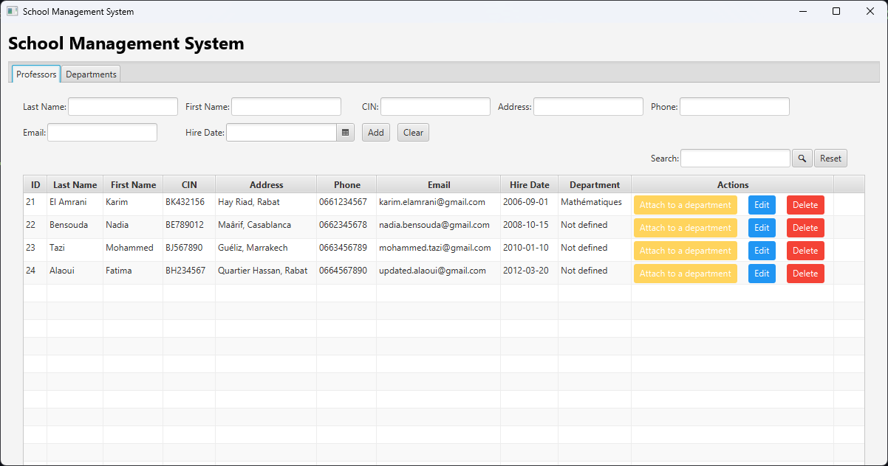

# Views Directory

This folder contains the FXML files that define the user interface of our application. Here you'll find:

- `main-view.fxml`: The main window of the application
- `professor-view.fxml`: The interface for managing professors
- `department-view.fxml`: The interface for managing departments

Each view is designed to be simple and user-friendly, making it easy to manage school data.

## Views Structure and Controller Connection

### 1. Main View (`main-view.fxml`)
````xml
<BorderPane xmlns:fx="http://javafx.com/fxml/1" xmlns="http://javafx.com/javafx/17.0.12"
            fx:controller="ma.enset.tp5.controller.MainController">
    <top>
        <VBox spacing="10" style="-fx-padding: 10;">
            <Text style="-fx-font-size: 24px; -fx-font-weight: bold;" text="School Management System"/>
            <TabPane fx:id="tabPane">
                <Tab closable="false" text="Professors" fx:id="professorTab">
                    <fx:include source="professor-view.fxml"/>
                </Tab>
                <Tab closable="false" text="Departments">
                    <fx:include source="department-view.fxml"/>
                </Tab>
            </TabPane>
        </VBox>
    </top>
</BorderPane>
````
The main view serves as the container for our application. It uses a BorderPane layout with:
- A title "School Management System" at the top
- A TabPane containing two tabs: Professors and Departments
- Connected to `MainController.java` using `fx:controller="ma.enset.tp5.controller.MainController"`
- Uses `fx:include` to embed the professor and department views

### 2. Professor View (`professor-view.fxml`)
````xml
<VBox spacing="10" xmlns:fx="http://javafx.com/fxml" fx:controller="ma.enset.tp5.controller.ProfessorController">
    <padding>
        <Insets top="20" right="20" bottom="20" left="20"/>
    </padding>

    <!-- Add/Edit Form -->
    <GridPane hgap="10" vgap="10">
        <HBox spacing="2" GridPane.columnIndex="0" GridPane.rowIndex="0">
            <Label text="Last Name:">
                <HBox.margin>
                    <Insets top="4.0"/>
                </HBox.margin>
            </Label>
            <TextField fx:id="lastNameField"/>
        </HBox>
        <HBox spacing="2" GridPane.columnIndex="1" GridPane.rowIndex="0">
            <Label text="First Name:">
                <HBox.margin>
                    <Insets top="4.0"/>
                </HBox.margin>
            </Label>
            <TextField fx:id="firstNameField"/>
        </HBox>
        <HBox spacing="2" GridPane.columnIndex="2" GridPane.rowIndex="0">
            <Label text="CIN:">
                <HBox.margin>
                    <Insets top="4.0"/>
                </HBox.margin>
            </Label>
            <TextField fx:id="cinField"/>
        </HBox>
        <HBox spacing="2" GridPane.columnIndex="3" GridPane.rowIndex="0">
            <Label text="Address:">
                <HBox.margin>
                    <Insets top="4.0"/>
                </HBox.margin>
            </Label>
            <TextField fx:id="addressField"/>
        </HBox>
        <HBox spacing="2" GridPane.columnIndex="4" GridPane.rowIndex="0">
            <Label text="Phone:">
                <HBox.margin>
                    <Insets top="4.0"/>
                </HBox.margin>
            </Label>
            <TextField fx:id="phoneField"/>
        </HBox>

        <HBox spacing="2" GridPane.columnIndex="0" GridPane.rowIndex="1">
            <Label text="Email:">
                <HBox.margin>
                    <Insets top="4.0"/>
                </HBox.margin>
            </Label>
            <TextField fx:id="emailField"/>
        </HBox>
        <HBox spacing="2" GridPane.columnIndex="1" GridPane.rowIndex="1">
            <Label text="Hire Date:">
                <HBox.margin>
                    <Insets top="4.0"/>
                </HBox.margin>
            </Label>
            <DatePicker fx:id="hireDatePicker"/>
        </HBox>

        <HBox spacing="10" GridPane.columnIndex="2" GridPane.rowIndex="1">
            <Button fx:id="addButton" text="Add" onAction="#handleAdd"/>
            <Button text="Clear" onAction="#handleClear"/>
        </HBox>
        <HBox spacing="2" GridPane.columnIndex="4" GridPane.rowIndex="2">
            <Label text="Search:">
                <HBox.margin>
                    <Insets top="4.0"/>
                </HBox.margin>
            </Label>
            <TextField fx:id="searchField"/>
            <Button text="🔍" onAction="#handleSearch"/>
            <Button text="Reset" onAction="#handleReset"/>
        </HBox>
    </GridPane>

    <!-- Professor Table -->
    <TableView fx:id="professorTable" VBox.vgrow="ALWAYS">
        <columns>
            <TableColumn fx:id="idColumn" text="ID"/>
            <TableColumn fx:id="lastNameColumn" text="Last Name"/>
            <TableColumn fx:id="firstNameColumn" text="First Name"/>
            <TableColumn fx:id="cinColumn" text="CIN"/>
            <TableColumn fx:id="addressColumn" text="Address"/>
            <TableColumn fx:id="phoneColumn" text="Phone"/>
            <TableColumn fx:id="emailColumn" text="Email"/>
            <TableColumn fx:id="hireDateColumn" text="Hire Date"/>
            <TableColumn fx:id="departmentColumn" text="Department"/>
            <TableColumn fx:id="actionsColumn" text="Actions"/>
        </columns>
    </TableView>
</VBox>
````
The professor management interface features:
- A form for adding/editing professors with fields for:
  - Last Name
  - First Name
  - CIN (National ID)
  - Address
  - Phone
- A table displaying professor records
- Connected to `ProfessorController.java` using `fx:controller="ma.enset.tp5.controller.ProfessorController"`
- Each form field is linked to the controller using `fx:id` attributes
#### Screenshot


### 3. Department View (`department-view.fxml`)
````xml
<VBox spacing="10" xmlns="http://javafx.com/javafx/17.0.12" xmlns:fx="http://javafx.com/fxml/1"
      fx:controller="ma.enset.tp5.controller.DepartmentController">
    <padding>
        <Insets bottom="20" left="20" right="20" top="20"/>
    </padding>

    <!-- Add/Edit Form -->
    <HBox spacing="12">
        <HBox spacing="4">
            <Label alignment="CENTER" text="Department Name:">
                <HBox.margin>
                    <Insets top="4.0"/>
                </HBox.margin>
            </Label>
            <TextField fx:id="departmentNameField"/>
        </HBox>
        <HBox spacing="10">
            <Button fx:id="addButton" onAction="#handleAdd" text="Add"/>
<!--            <Button onAction="#handleUpdate" text="Update"/>-->
            <Button onAction="#handleClear" text="Clear"/>
        </HBox>
    </HBox>

    <!-- Department Table -->
    <TableView fx:id="departmentTable">
        <columns>
            <TableColumn fx:id="idColumn" text="ID" prefWidth="100"/>
            <TableColumn fx:id="nameColumn" text="Name" prefWidth="200"/>
            <TableColumn fx:id="actionColumn" text="Actions"/>
        </columns>
    </TableView>
</VBox>
````
The department management interface includes:
- A simple form with:
  - Department Name field
  - Add, Clear buttons
- A table showing departments with columns for:
  - ID
  - Name
  - Actions
- Connected to `DepartmentController.java` using `fx:controller="ma.enset.tp5.controller.DepartmentController"`

### Screenshot

## Controller Connection
Each FXML file is connected to its respective controller through:
1. The `fx:controller` attribute in the root element
2. `fx:id` attributes on UI elements that need controller interaction
3. Event handlers (like `onAction="#handleAdd"`) that link UI events to controller methods

For example, in the Department view:
```xml
fx:controller="ma.enset.tp5.controller.DepartmentController"
<TextField fx:id="departmentNameField"/>
<Button onAction="#handleAdd" text="Add"/>
```

The controller can then access these elements using:
```java
@FXML
private TextField departmentNameField;

@FXML
private void handleAdd() {
    // Handle add operation
}
```

## Conclusion
This view system provides a clean and organized way to manage school data. The separation between FXML views and their controllers follows the MVC pattern, making the code maintainable and easy to update. Each view is designed with user experience in mind, providing intuitive interfaces for managing both professors and departments within the school system.